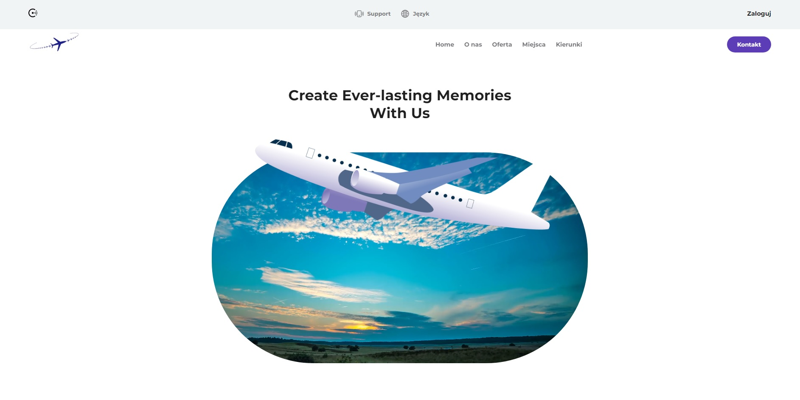
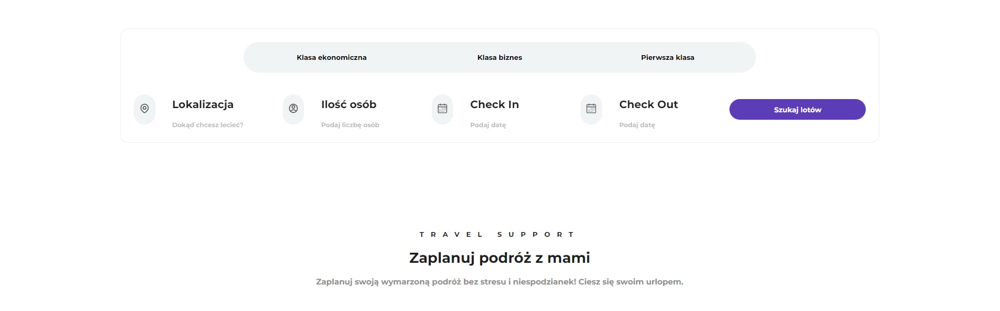
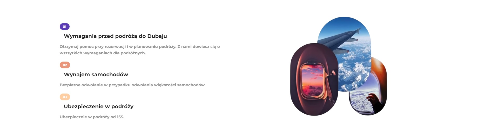
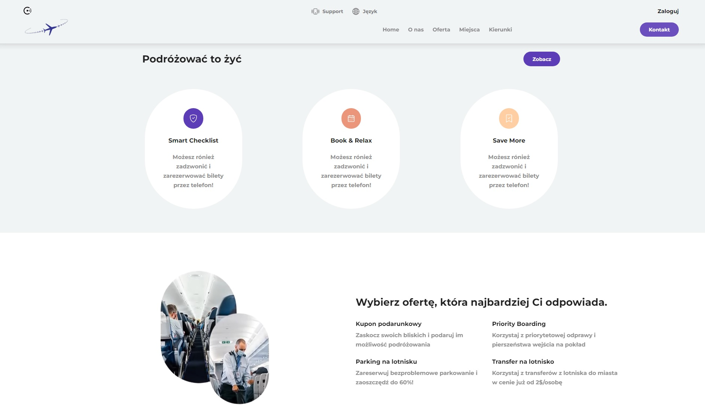
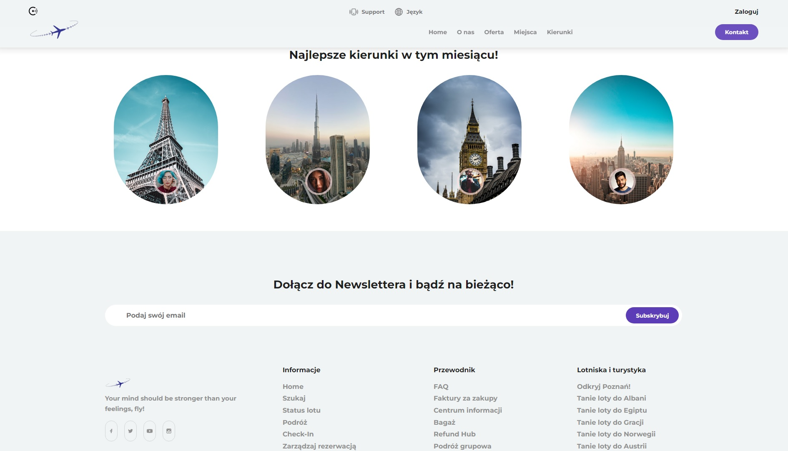

# Find-Your-Flight

<br/>


<br/>

## :scroll: Project description

A static flight search page built in ReactJS and using SCSS.

## :hammer_and_pick: Built With

- React
- JavaScript
- Aos animation
- React Icons

<br/>







## Project setup

```
npm install
```

### Compiles and hot-reloads for development

```
npm start
```

### Compiles and minifies for production

```
npm run build
```

<br/>
